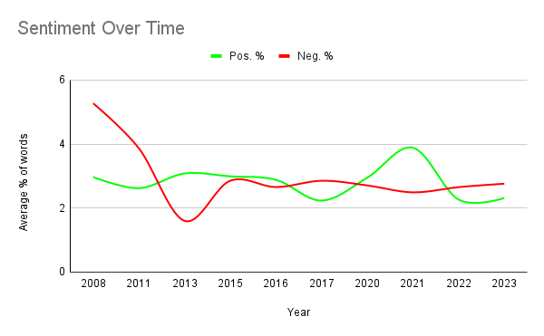
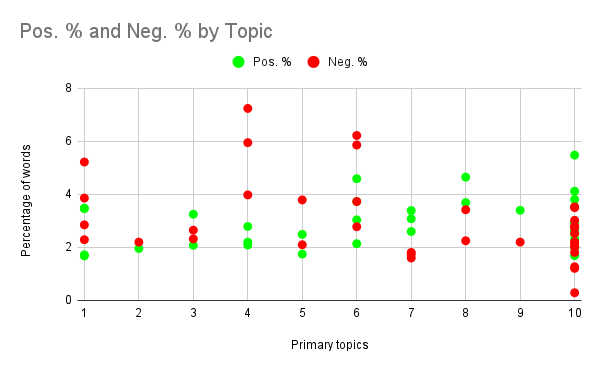

# Sentiment(al) Analysis

When it comes to “idiosyncrasies that changed (or stayed the same) over time,” what very much comes to mind first is what I write about and how I feel about myself while I’m writing it. Which means we’re doing sentiment analysis.

It turns out Voyant could help me out here, thanks to its (“new experimental”) [Categories](https://voyant-tools.org/docs/#!/guide/categories) feature that I decided to test for this portion of the project. Basically, Voyant has created a list of “positive” words and a list of “negative” words — a rudimentary form of sentiment analysis. And as someone who considers my writing rather negative, I am a total sucker for this stuff.

Voyant can tell me how many words it has categorized as “positive” and “negative,” so I grabbed these numbers for each of the 37 pieces in my corpus; then, I calculated the percentage of “positive” and “negative” words per piece and added them to my spreadsheet.

I was most interested in analyzing this through the lens of time — how “positive” and “negative” has my memoir writing been over time? Here’s what I came up with:

That’s what teen angst looks like! (I started undergrad in 2008.)

I’m seeing a couple of other things, though, namely that first “negative” crater in 2013. This reflects the small sample size — there’s only one piece from 2013 in my corpus, and Voyant just didn’t think it wasn’t a negative one. (For the record, neither do I.) Overall, I’m less surprised by the “negative” line eventually flattening out and more intrigued by how flexible the “positive” line has been. When I perceive my writing as “negative,” am I really just coming to this conclusion based on the relative absence or presence of “positivity”? (I’m going to stop using scare quotes around “positive” and “negative” right…_now_.)

When I think about this graph in the context of my topics, I am wholly unsurprised that my 2008 writing was so negative. A quick look at Topic 6 (“growing up with my parents”) reveals both that it was the primary topic for writing I did in 2008 and one of the most negative topics overall.

I created another questionably useful graph that, at least for this moment, does visualize what I need it to visualize:

Similar to Topic 6, Topic 4 (“mental illness history”), is fueled by two of my most negative pieces overall by percentage of words. Meanwhile, Topic 7 (“my history playing music”) and Topic 8 (“considerations of gender”) both trend positive. (Note: My writing about gender stuff, to me, is not always positive! I was fraught writing much of it! But also…Topic 8 is not really about gender, even though it is. More on that later.)

True to form, I’d like to dig into the negatives. I’m pretty sure I know why Topic 4 (“mental illness history”) and Topic 6 (“growing up with my parents”) are fueled by negative writings. But why does Voyant think this? My hypothesis has to do both with the newness of the Categories tool and of the way I’m pretty sure I approached these topics when I wrote about them: that it was the words I used to describe my parents and home life that Voyant perceived as negative, while it flagged mental health and mental illness jargon _itself_ as negative. (One thing to note about the Categories feature is that nowhere does Voyant share how it decided which words were positive and negative, nor are sentiments weighted. While [VADER](https://vadersentiment.readthedocs.io/en/latest/index.html) — a much more sophisticated sentiment analysis tool — has robust documentation that covers all of this, Voyant’s positive/negative word association exists only on its own.)

Rather than look at all of the pieces associated with Topic 4 and Topic 6, I decided to focus on the pieces where Topic Modeling Tool said either 4 or 6 was the most notable topic (and narrow my sample size to an even less statistically significant total, but it’s fine). That came out to three pieces for Topic 4 and four pieces for Topic 6. Then, I exported just the negative words as individual text files so I could ask OpenRefine to tell me which words were most common in each file. (Voyant can allegedly do this, but its results were just…not…correct?)

These are the top 10 words in each set of writings that represent these topics (Note: Because I stopped at 10, some words with the same frequencies as the bottom words were left out because OpenRefine alphabetizes words sorted by count):

| Topic 4 (mental illness) | Topic 6 (parents) |
|---|---|
| anxiety (22) | anger (8) |
| death (10) | annoyed (3) |
| **attack (8)** | **depression (3)** |
| break (6) | lose (3) |
| die (6) | negative (3) |
| fall (6) | problem (3) |
| illness (6) | rage (3) |
| symptoms (6) | stubborn (3) |
| darkness (5) | angry (2) |
| **depression (5)** | **attacks (2)** |

Not to be too unfairly succinct, but, yeah, this is about what I expected. “Anxiety,” “attack” (7 of 8 were used in conjunction with “anxiety,” as in “anxiety attack”), “illness,” “symptoms,” and “depression” feature heavily in Topic 4, all clinical-ish terms to do with mental illness as a thing. Meanwhile, Topic 6 sees a list of words that describe my feelings, reactions, experiences, and emotions surrounding growing up with my parents: anger, annoyance, rage, stubbornness. I was also interested in how “depression” and “attack(s)” appear on both lists, because my assumption is that the contexts are different — for example, “depression” in Topic 4 probably refers to clinical depression, while “depression” in Topic 6 refers to the feeling of being depressed. When I looked at each piece, I confirmed that this was completely accurate.

Thinking about Voyant’s Categories as a whole, I would say that some of these words I agree with and some of them I aggressively don’t. In the contexts in which I use it, yes, “anxiety” is absolutely negative. I can also understand an argument where it could be neutral — for example, “I have anxiety” could just be a statement of fact — but not how I’ve used it in these pieces. But I have some questions. For instance, “break” is tagged as negative, even though I’ve most frequently used it in the context of an academic year: spring break, winter break, summer break, and so on. Could these *terms* have positive or negative connotations to different people? One hundred percent. Do I think that’s what Voyant is getting at? No, I think it’s just categorized “break” as in a broken thing.

Just for fun, here are some more words that Voyant has in its negative category:

- **Cloud:** To be fair, I used the verb form in a negative way. But I’m not sure this tool is sophisticated enough to not tag the noun as negative, too. Sometimes a cloud is just a cloud. (Take that, Wordsworth.)
- **Hum:** [I OED’d this](https://www.oed.com/search/dictionary/?scope=Entries&q=hum) because I could not come up with a single negative use for “hum” on my own. It turns out there are many. However, when I used “hum” in my work to refer to me playing the flute, I did not mean it negatively.
- **Indulge:** For those who attach morality to food, I understand that “indulge” often colloquially refers to, like, indulging oneself because they’re “cheating” or “being bad” or whatever. I disagree.
- **Myth:** Yet again, sometimes negative, but sometimes a myth is just a thing, and sometimes it’s a very culturally important, positive thing.
- **Tank:** Once again, Voyant has determined that the verb form is negative, but the noun form is caught in the crossfire. I personally think a goldfish having a place to live is neat.
- **Literally just the letter F:** This one’s on me. Voyant means it like the grade. Unfortunately, this is a data cleaning error — I have a few instances of French words that start with F and the next letter has a diacritic, e.g. “fête.” But since Voyant ignores diacritics, the word becomes “F.”

## Questions/Thoughts for Further Study

- Despite my brand as someone who writes about negative topics, I’d like to know more about the positive words. Are there any neat connotations I can draw from these? Are any topics or experiences more “positive” than others?
- Voyant allows you to add and remove positive and negative words to categories. What might happen if I edited the existing lists to better suit my work? Obviously this would introduce more bias to an already very biased analysis, but could the bias introduced through this action be clarifying? Or would it just muddle the data and lead me to attempt to draw conclusions from a dataset that just doesn’t work anymore? (When would I know when to stop editing?)
- Of course, other tools — like VADER — approach sentiment analysis differently, so I’d be interested to see how these tools interpret my work.